# 
 Building A SOC + Honeynet in Azure (Live Traffic)   Step-By-Step Deployment

## Introduction

This project aims to set up a comprehensive Cloud Honeynet integrated with a Security Operations Center (SOC) using Microsoft Azure services. The objective is to deploy a virtualized environment that simulates a vulnerable cloud infrastructure, which is then monitored for security incidents using Microsoft Sentinel. The project provides hands-on experience with setting up cloud resources, configuring security monitoring tools, and analyzing security logs to detect and respond to potential threats.

This project is divided into several parts, starting with the creation of cloud resources in Azure, configuring logging and monitoring using Microsoft Sentinel, and ending with securing the cloud environment based on best practices and compliance standards.

## Table of Contents

- [Introduction](#Introduction)
- [Part 1: Azure Setup](#Part-1-Azure-Setup)
  - [Step 1: Creating Subscription and Resource](#Step-1-Creating-Subscription-and-Resource)  
  - [Step 2: Installing Microsoft SQL Server](#Step-2-Installing-Microsoft-SQL-Server)
  - [Step 3: Security Operations](#Step-3-Security-Operations)
  - [Step 4: Microsoft Entra ID (Azure Active Directory)](#Step-4-Microsoft-Entra-ID-Azure-Active-Directory)
- [Part 2: Logging and Monitoring](#Part-2-Logging-and-Monitoring)
  - [Step 1: Geo IP Data Ingestion and Microsoft Sentinel Setup](#Step-1-Geo-IP-Data-Ingestion-and-Microsoft-Sentinel-Setup)
  - [Step 2: Enabling Microsoft Defender for Cloud](#Step-2-Enabling-Microsoft-Defender-for-Cloud)
  - [Step 3: Log Collection for VMs and Network Security Groups](#Step-3-Log-Collection-for-VMs-and-Network-Security-Groups)
  - [Step 4: Logging for Microsoft Entra ID and Other Resources](#Step-4-Logging-for-Microsoft-Entra-ID-and-Other-Resources)
  - [Step 5: Subscription Level Logging (Activity Log)](#Step-5-Subscription-Level-Logging-Activity-Log)
  - [Step 6: Resource Level Logging](#Step-6-Resource-Level-Logging)
- [Part 3: Microsoft Sentinel (SIEM)](#Part-3-Microsoft-Sentinel-SIEM)
  - [Step 1: World Maps Construction](#Step-1-World-Maps-Construction)
  - [Step 2: Automatic Alert Creation](#Step-2-Automatic-Alert-Creation)
  - [Step 3: Running the Insecure Environment](#Step-3-Running-the-Insecure-Environment)
- [Part 4: Secure Cloud Configuration](#Part-4-Secure-Cloud-Configuration)
  - [Step 1: Containment and Recovery](#Step-1-Containment-and-Recovery)
  - [Step 2: Regulatory Compliance](#Step-2-Regulatory-Compliance)
  - [Step 3: Securing Resources](#Step-3-Securing-Resources)
  - [Step 4: Running the Secure Environment](#Step-4-Running-the-Secure-Environment)
- [Part 5: Environment Cleanup](#Part-5-Environment-Cleanup)
  - [Step 1: Delete Resource Groups](#Step-1-Delete-Resource-Groups)
  - [Step 2: Remove Microsoft Entra ID Accounts](#Step-2-Remove-Microsoft-Entra-ID-Accounts)
  - [Step 3: Deprovision Subscription and Log Analytics Workspace](#Step-3-Deprovision-Subscription-and-Log-Analytics-Workspace)
- [Conclusion](#Conclusion)    

## 
 Step-By-Step Deployment

## Part 1: Azure Setup

### <ins>Step 1: Creating Subscription and Resource</ins>
  - Create our Account (Tenant) and Subscription
    - Create Azure Account (do not user your work or school account)
    - Create Azure Subscription
  - Create Windows 10 Pro Virtual Machine (Name it windows-vm)
    - See all sizes, strong password
    - Region: EAST US 2
    - Name the Resource Group: RG-Cyber-Lab
    - Name the Virtual Network: Lab-VNet
  - Create one more Virtual Machine running Ubuntu (Linux) name it: linux-vm
    - Same Region, Resource Group, and VNet as windows-vm
    - Region: EAST US 2
    - For the VM size, do not choose B1s, choose something larger or it will get DDOS and stop creating logs
    - Ensure you use a username and password instead for authentication
  - Open Network Security Groups for both VMs
    - Configure Network Security Group (Layer 4 Firewall) to allow all traffic inbound
   

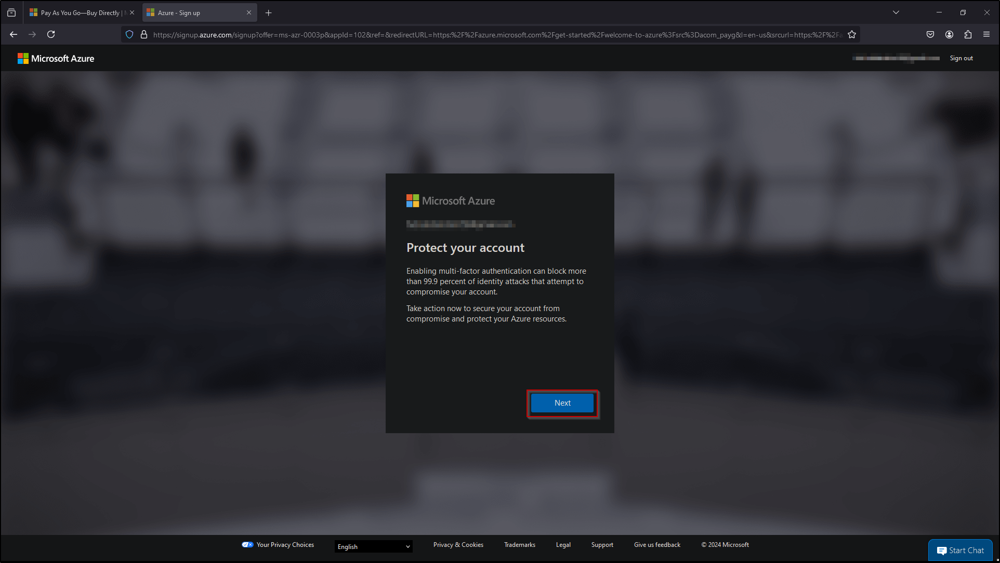

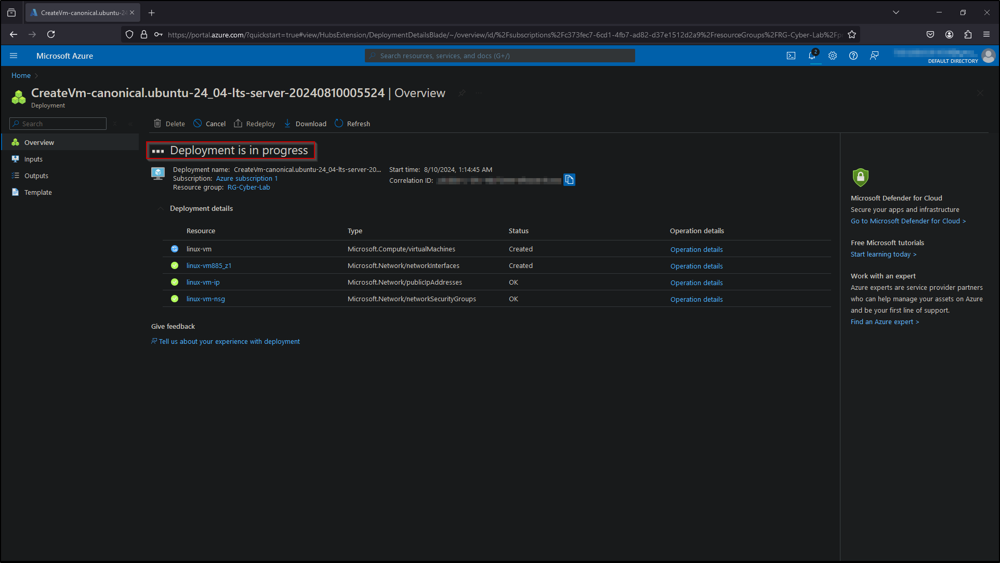

### <ins>Step 2: Installing Microsoft SQL Server</ins>
  - Disable Windows Firewall and Install SQL Server and Create Vulnerabilities
    - Remote into to the VM (windows-vm)
    - Turn off Windows Firewall
    - Install SQL Server Evaluation
    - Install SSMS (SQL Server Management Studio)
    - Enable logging for SQL Server to be ported to Windows Event Viewer
    - Test SQL logging to make sure it’s working properly
- Test ping and logging into linux-vm via SSH
  - Ping linux-vm
  - Login to linux-vm

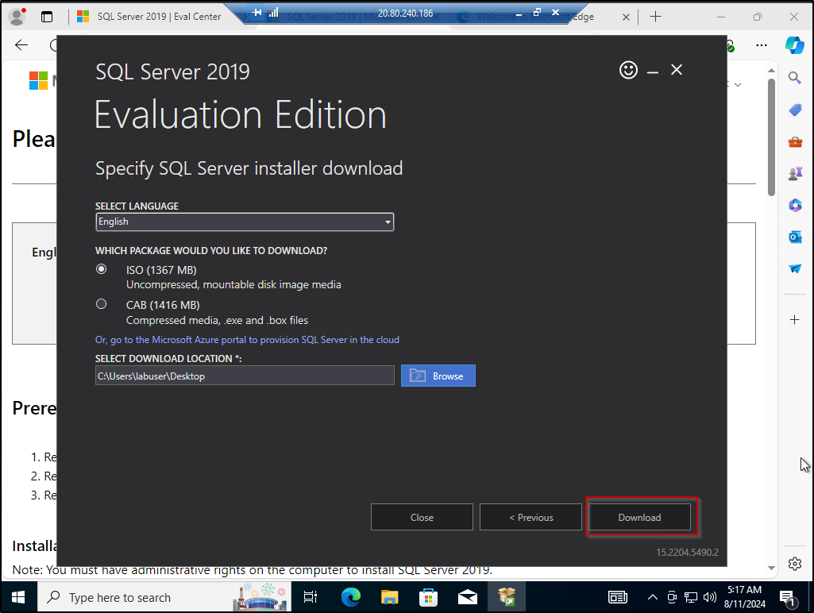

### <ins>Step 3: Security Operations</ins>
- Admin Mode
  - RDP back into windows-vm
  - Inspect the failures and successes (Security Log for RDP, Application log for SQL)
  - Take notes of the EventIDs, messaging, Source IP addresses, etc
- SSH into the linux-vm, observe logs with the following commands
    
      cat /var/logs/auth.log | grep password 
      cat /var/logs/auth.log | grep Accepted

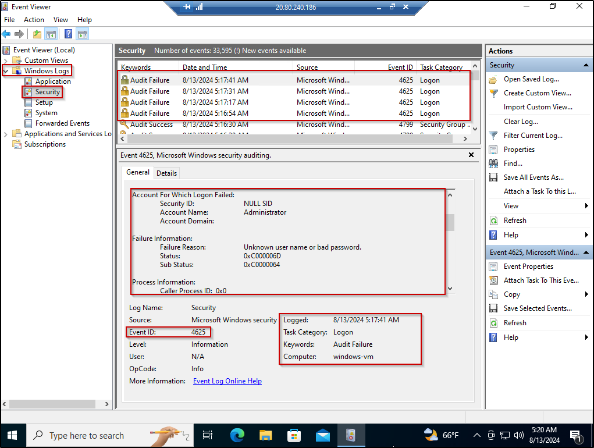

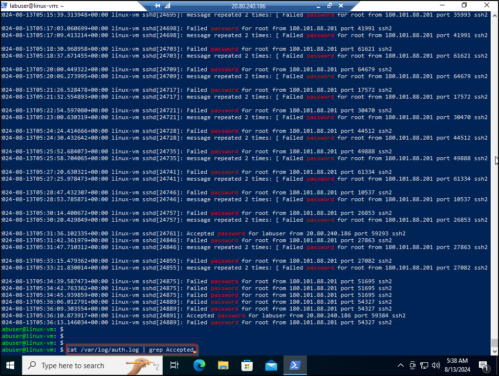

### <ins>Step 4: Microsoft Entra ID (Azure Active Directory)</ins>
- Configure Tenant-Level Global Reader
  - Create a user within Microsoft Entra ID (username: globalreaderjohn)
    - Assing Tenant-Level Global Reader
- Configure Subscription Reader
  - Create another user with Microsoft Entra ID (username: subreaderjane)
    - Assign Subscription-Level Reader
- Configure Resource Group Contributor (like an admin)
  - Create another user within Microsoft Entra ID (username: rgcontributordave)
    - Assign Resource Group-level Contributor
    - For resource group (RG-Cyber-Lab), assign Contributor Permissions

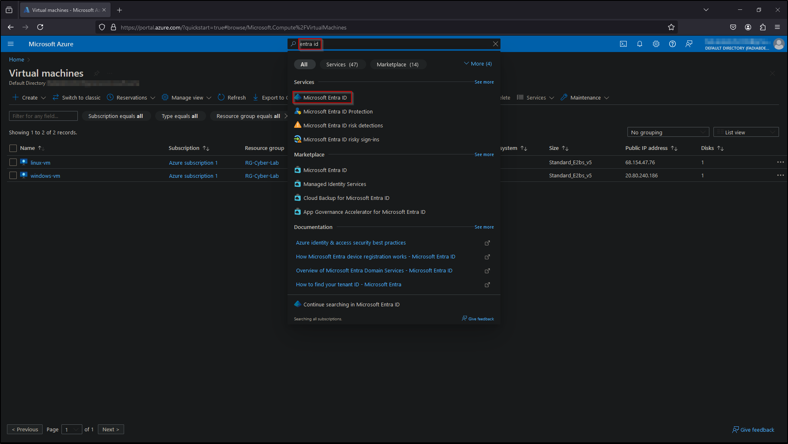

   
## Part 2: Logging and Monitoring

### <ins>Step 1: Geo IP Data Ingestion and Microsoft Sentinel Setup</ins>
- Add Large Geo-Data Files in Azure Storage
  - Use geoip-summarized.csv file
- Create a Log Analytics Workspace (log aggregator) named: LAW-Cyber-Lab
- Setup Sentinel and connect it to Log Analytics Workspace
  - Create the geoip watchlist
    - Name/Alias: geoip
    - Source type: Local File
    - Number of lines before row: 0
    - Search Key: network
  - Use _GetWatchlist(“geoip”) in Log Analytics Workspace to verify Geo-Data has loaded

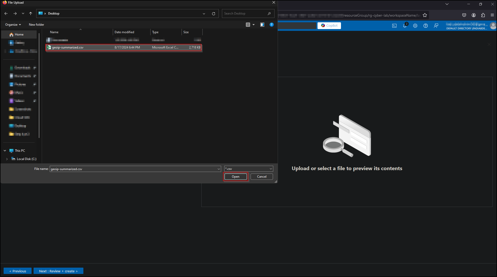

### <ins>Step 2: Enabling Microsoft Defender for Cloud</ins>
- Enable Microsoft Defender for Cloud for Log Analytics Workspace
  - Enable Defender Plans for VMs and SQL Instances on VMs
  - Enable Data Collection (All Events)
- Enable Microsoft Defender for Cloud for Subscription
  - VMs, Storage Accounts, Key Vault, SQL Server
  - Make sure logs are being sent to correct log analytics workspaces
- Enable Microsoft Defender for Cloud Continuous Export in Environment Settings
  - Export to the correct Log Analytics Workspace

### <ins>Step 3: Log Collection for VMs and Network Security Groups</ins>
- Create Azure Storage Account (sacyberlab01)
  - Must be in the same region as VMs
  - This will be used to store the NSG Flow Logs
- Enable Flow logs for both Network Security Groups (NSGs)
- Configure Data Collection Rules within our Log Analytics Workspace
  - Configure Linux Data Sources (auth only)
    - Linux-vm-logs
  - Configure Windows Data Sources (Application-information only, Security-All)
    - Windows-vm-logs
  - Configure Special Windows Event Data Collection (Defender and Windows Firewall)
- Manually install the Log Analytics Agent on both windows-vm and linux-vm
- Query Log Analytics for logs from the VMs and NSGs
  - Syslog (linux)
  - SecurityEvent (windows)
  - AzureNetworkAnalytics_CL (NSGs)

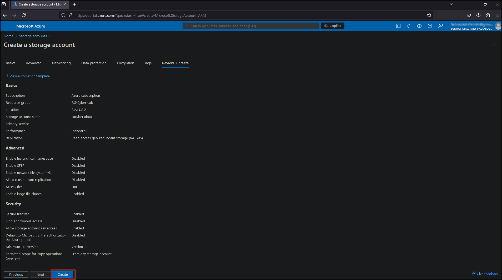

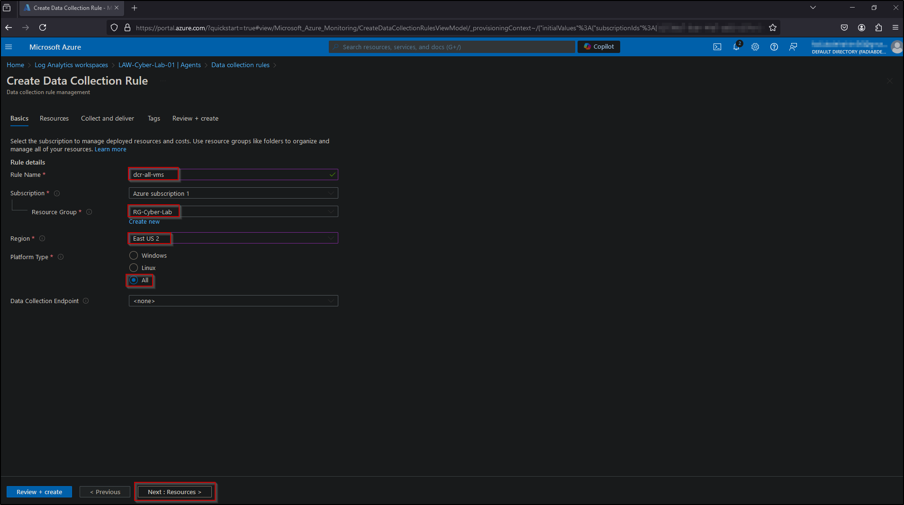

### <ins>Step 4: Logging for Microsoft Entra ID and Other Resources</ins>
- Create Diagnostic Settings to ingest Microsoft Entra ID logs
  - Enable Audit logs and Sign in Logs for Microsoft Entra ID

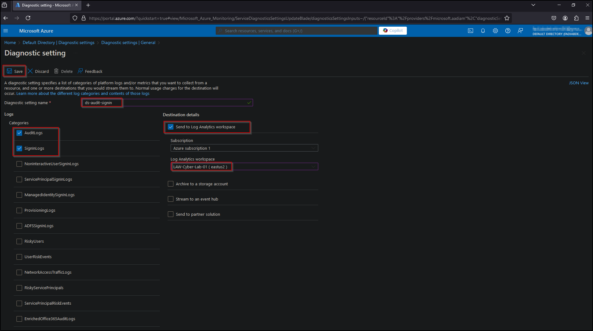

### <ins>Step 5: Subscription Level Logging (Activity Log)</ins>
- Export Azure Activity Logs to Log Analytics Workspace

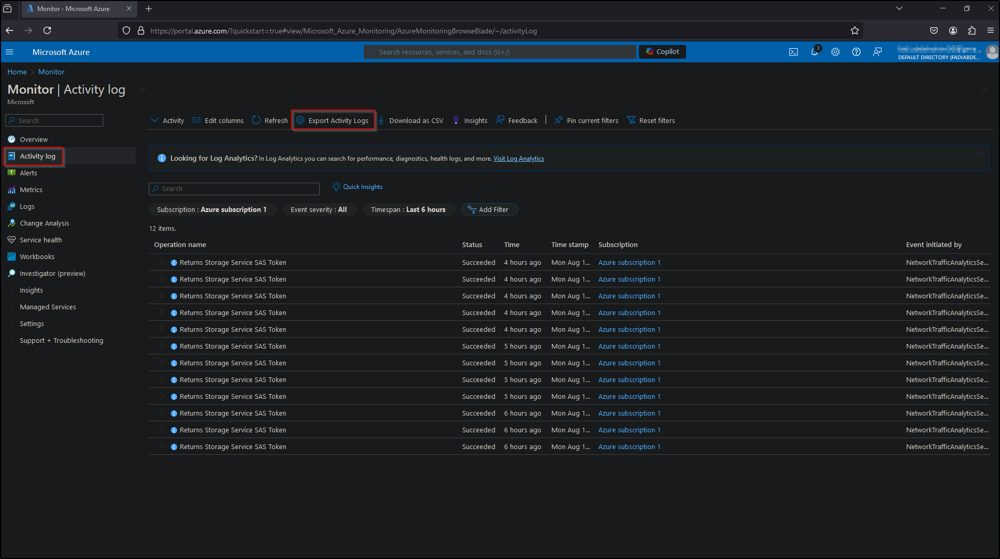

### <ins>Step 6: Resource Level Logging</ins>
- Configure Logging for Azure Storage
  - Configure logging for storage account by enabling diagnostics settings for blob storage
-  Configure Logging for Key Vault
  -  Create a Key Vault Instance and collect the audit log and send to Log Analytics Workspace

## Part 3: Microsoft Sentinel (SIEM)

### <ins>Step 1: World Maps Construction</ins>
- Within Azure Sentinel create the following workbooks
  - windows-rdp-auth-fail.json – Create the Windows RDP/SMB Authentication Failure map
  - linux-ssh-auth-fail.json – Create the Linux SSH Authentication Failures map
  - mssql-auth-fail.json – Create MS SQL Server Authentication Failures map
  - nsg-malicious-allowed-in.json – Create the NSG Allowed Malicious Inbound

### <ins>Step 2: Automatic Alert Creation</ins>
- Import all Sentinel Analytics Rules

### <ins>Step 3: Running the Insecure Environment</ins>
- Let the environment sit for 24 hours
- Count all the alerts that happened in last 24 hours

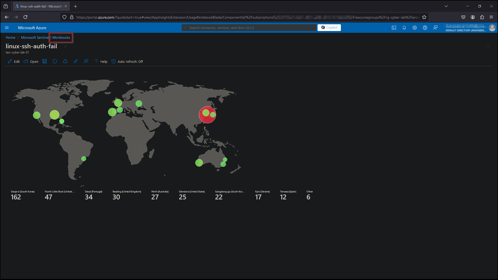

## Part 4: Secure Cloud Configuration

### <ins>Step1: Containment and Recovery</ins>
- Lock down the NSG assigned to the VMs to allow only necessary traffic

### <ins>Step 2: Regulatory Compliance (Enable NIST 800-53)</ins>
- Enable MDC Regulatory Compliance (NIST 800-53)

### <ins>Step 3: Securing Resources (NIST SC-7)</ins>
- Implement SC-7
- Configure Azure Private Link and Firewall for Azure Key Vault Instances
- Configure Azure Private Link and Firewall for Azure Storage Account Instance
  - Disable Public Access
- Login to windows-vm and check the IP address of Key Vault and Storage Account Instance
- Create NSG and attach to subnet

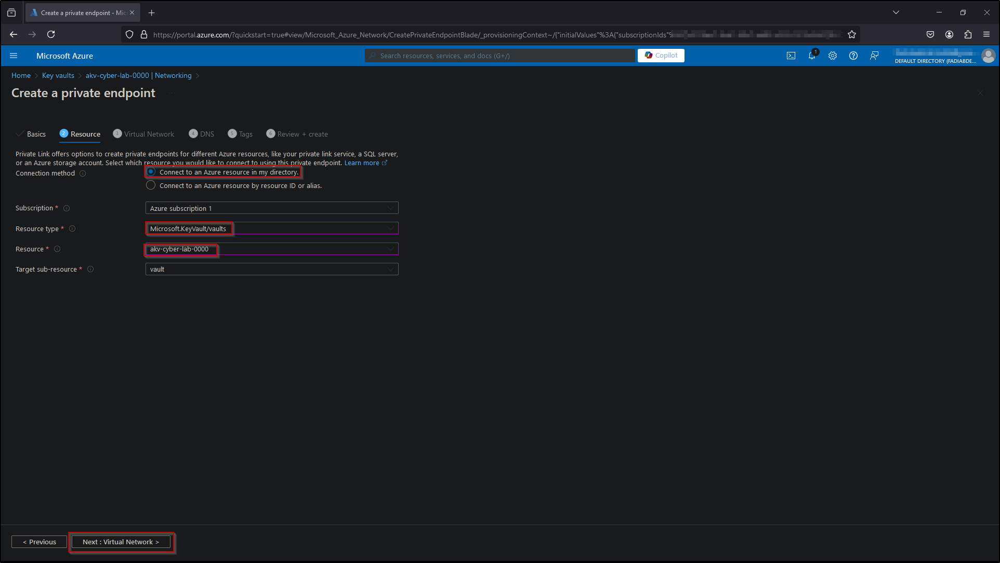

### <ins>Step 4: Running the Secure Environment</ins> 
- Let the environment sit for 24 hours
- Count all the alerts that happened in last 24 hours

## Part 5: Environment Cleanup

### <ins>Step 1: Delete Resource Groups</ins>
- Delete all resource groups

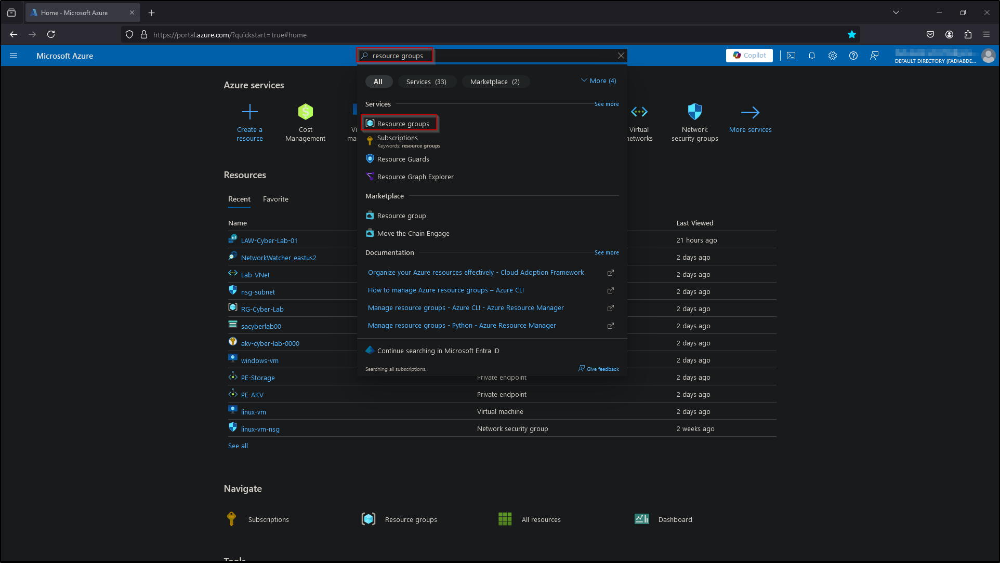

### <ins>Step 2: Remove Microsoft Entra ID Accounts</ins>
- Go to Microsoft Entra ID and delete all accounts
- In Microsoft Entra ID ensure diagnostic settings have been deleted

### <ins>Step 3: Deprovision Subscription and Log Analytics Workspace</ins>
- Go to Microsoft Defender for Cloud -> Environment Settings and deprovision the subscription and Log Analytics Workspace

## Conclusion

This project provides a comprehensive guide to setting up a secure cloud environment, simulating real-world attacks, and monitoring security events using Azure and Microsoft Sentinel. By following the steps outlined, you will gain practical experience in cloud security operations, including the deployment of a honeynet, configuration of security monitoring tools, and implementation of security controls to protect cloud resources. The project emphasizes the importance of continuous monitoring and compliance in maintaining a secure cloud infrastructure.

